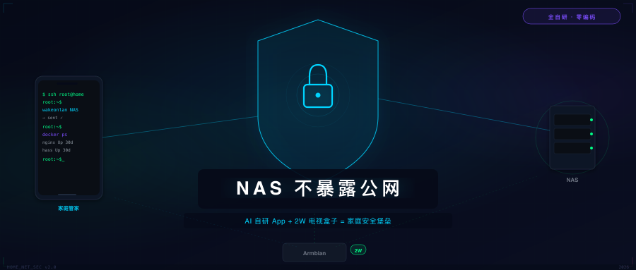
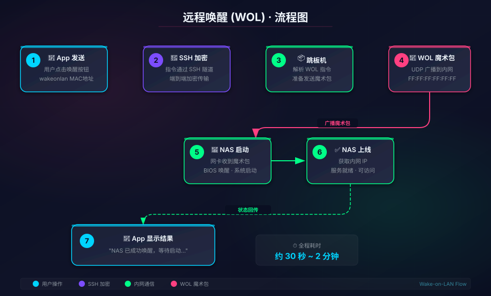
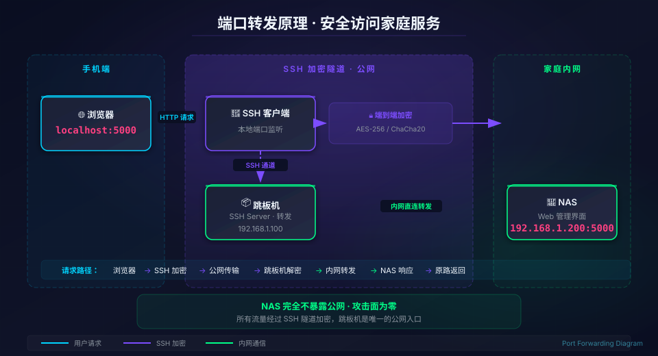
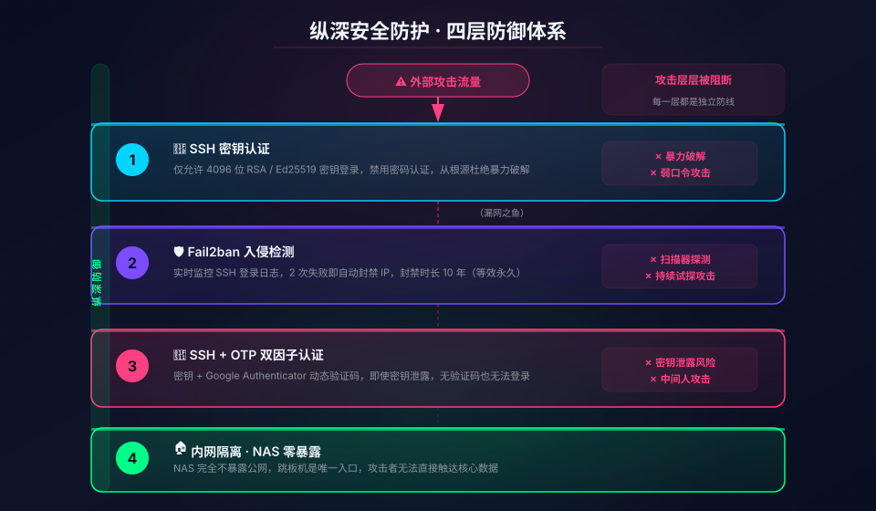
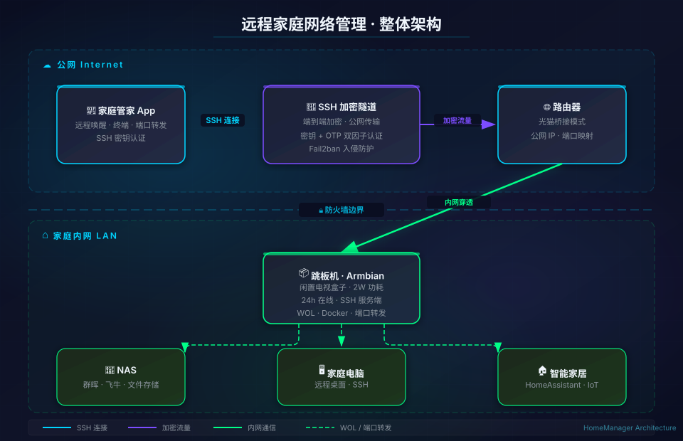

<p align="center">
  
</p>

<h1 align="center">HomeManager · 家庭管家</h1>

<p align="center">
  <strong>一个 App 管理整个家庭网络 —— 安全、零成本、全自研</strong>
</p>

<p align="center">
  
  
  
  
</p>

---

**你的 NAS 还在公网裸奔吗？**

飞牛 FNOS 漏洞事件敲响了警钟——把 NAS 暴露在公网，等于在自家门口贴了个「欢迎光临」的牌子。

HomeManager 给出的解法是：**用一个闲置电视盒子（功耗仅 2W）当跳板机，手机通过 SSH 隧道安全连接，实现远程唤醒、终端管理、端口转发——全程 NAS 不暴露公网。**

---

## 核心功能

<table>
  <tr>
    <td align="center" width="25%">
      <br><br>
      <strong>远程唤醒</strong><br>
      <sub>一键 WOL 魔术包<br>NAS 随时随地唤醒</sub>
    </td>
    <td align="center" width="25%">
      <br><br>
      <strong>端口转发</strong><br>
      <sub>SSH 隧道加密转发<br>手机访问内网服务</sub>
    </td>
    <td align="center" width="25%">
      <br><br>
      <strong>安全防护</strong><br>
      <sub>密钥认证 + Fail2ban<br>NAS 不暴露公网</sub>
    </td>
    <td align="center" width="25%">
      <br><br>
      <strong>完整架构</strong><br>
      <sub>跳板机 + SSH 隧道<br>零成本家庭堡垒</sub>
    </td>
  </tr>
</table>

---

## 为什么选择 HomeManager？

| 对比维度 | NAS 直接开公网 | FRP/花生壳 | 商业远程控制 | Tailscale | **HomeManager** |
|---------|--------------|-----------|------------|-----------|----------------|
| 安全性 | 极低 | 中低 | 中 | 高 | **极高** |
| 成本 | 免费 | 免费/付费 | 免费/付费 | 免费/付费 | **零成本** |
| NAS 暴露公网 | 是 | 是 | 是 | 否 | **否** |
| 依赖第三方 | 否 | 是 | 是 | 是 | **否** |
| 功能丰富度 | 一般 | 一般 | 高 | 一般 | **高** |

**一句话总结：安全性拉满、零成本、不依赖第三方、NAS 完全不出家门。**

---

## 方案架构

<p align="center">
  
</p>

**关键点：NAS 从来不出家门，只有跳板机暴露在公网，而且有 SSH 密钥 + Fail2ban 保护。**

---

## 技术特性

- **SSH 密钥认证**：仅支持密钥登录，禁用密码，杜绝暴力破解
- **自研终端模拟器**：ANSI 解析、256 色、CJK 字符支持、6 套主题
- **双会话池设计**：业务会话和终端会话互不干扰
- **端口转发引擎**：本地/远程双向转发，规则持久化
- **后台持续连接**：前台服务 + WakeLock，SSH 隧道稳定不断
- **暗色科技风 UI**：Material Design 暗色主题

---

## 快速开始

### 前置条件

1. 一台家庭跳板机（任意低功耗设备均可，如闲置电视盒子、树莓派等）
2. 公网 IP（运营商免费申请）
3. SSH 密钥对（跳板机上配置好）

### 安装步骤

```bash
# 1. 克隆项目
git clone https://github.com/wu560130911/HomeManager.git

# 2. 用 Android Studio 打开项目

# 3. 编译安装到手机
./gradlew assembleDebug

# 4. 打开 App，添加 SSH 连接配置，开箱即用
```

### 配置连接

1. 打开 App → 添加连接
2. 输入跳板机公网 IP 和 SSH 端口
3. 选择 SSH 私钥文件
4. 点击连接，搞定

---

## 项目结构

```
homemanager/
├── app/src/main/java/com/wms/homemanager/
│   ├── model/          # 数据模型（连接配置、转发规则）
│   ├── service/        # SSH 服务（前台保活、会话管理）
│   ├── terminal/       # 自研终端模拟器（ANSI 解析、渲染、主题）
│   ├── ui/             # 界面（登录、主页、各功能 Fragment）
│   └── utils/          # 工具类（文件、配置、字符串处理）
├── img/                # 文档图片资源
└── openspec/           # OpenSpec 工作流文档
```

---

## 持续更新

本项目持续根据作者自身使用场景和实际需求进行开发迭代，遇到新的问题或需求时会不断扩展功能并更新代码。

---

## 相关文章

本项目是「家庭网络管理」系列的第四篇，前三篇讲述了基础设施的搭建过程：

1. [联通光猫改桥接保姆级教程](https://mp.weixin.qq.com/s/H9QiqedxNHJ2RFyesbET0Q) — 获得公网 IP
2. [闲置电视盒子刷 Armbian 当服务器](https://mp.weixin.qq.com/s/CDBTtnBL3YSLhwJXZaahCg) — 搭建跳板机
3. [Armbian 公网 SSH 安全加固指南](https://mp.weixin.qq.com/s/i7idvQA_BdeucrM5_5_3SA) — 安全配置
4. **本篇：家庭管家 App —— 一个 App 管理整个家庭网络**

---

## 关注公众号

持续分享家庭网络、NAS、智能家居的实用教程和折腾经验。

<p align="center">
  
</p>

---

## 开源协议

本项目采用 [Apache License 2.0](LICENSE) 开源协议。

---

<p align="center">
  <em>数据安全这件事，不能交给别人。</em><br>
  <em>HomeManager —— 让你的家庭网络，安全可控。</em>
</p>
